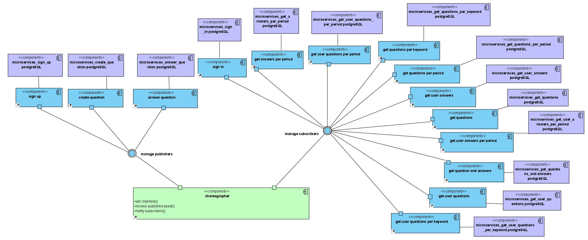
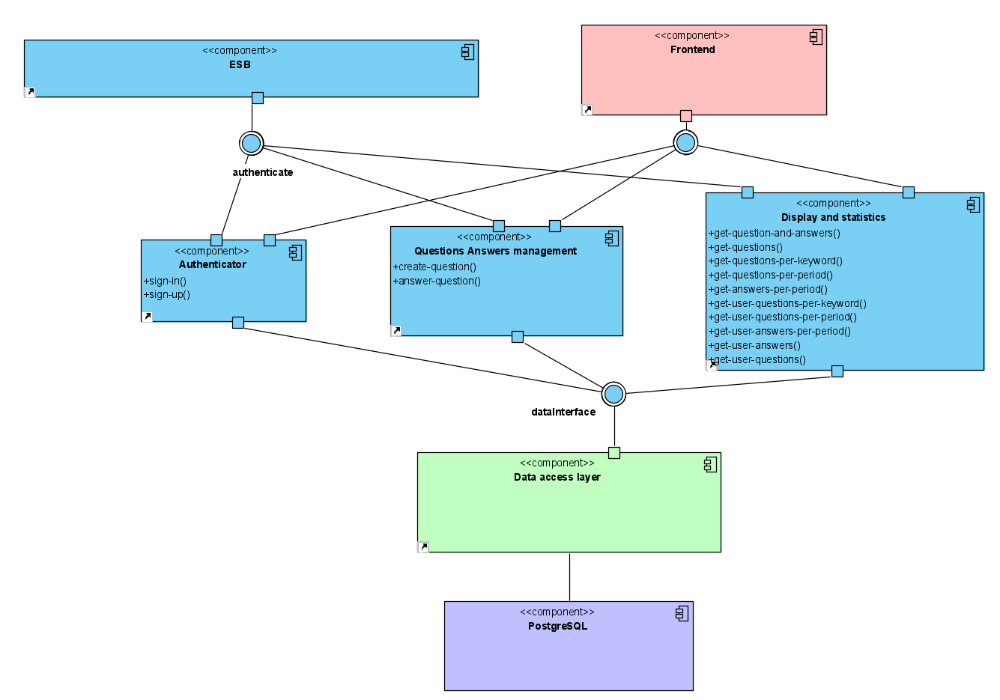

# Software as a Service semester assignment

## Description
This repository demonstrates the development of an **ask a question** app in 3 different software architectures:
* Monolithic
* Service-oriented architecture (SOA)
* Microservices

In each of those architectures the application gives the same user experience from the frontend environment, but is designed following the corresponding architecture patterns from those 3 famous architectures.

## Technologies used
To create this app the following technologies were used:
* **React JS** for the frontend environment
* **Node JS** and **Express** framework to develop the backend environment
* **Redis** for messaging between the microservices
* **PostgreSQL** as the database system

## Documentation
The different architecture choises that were made for each of the 3 architectures, can be seen in the `documentation` folder. Apart from the vpp(Visual Paradigm) projects, there are some images that show those diagrams that were created.

## Deployment
The SOA and Microservices architecture where deployed on [Heroku](https://www.heroku.com/), using different apps for each one of the components. The databases were created in [linode.com](linode.com) using a [PostgreSQL image](https://www.linode.com/docs/guides/deploy-postresql-with-marketplace-apps/).

## Microservices architecture

The different components of the microservices architecture can be seen in the component diagram below:

## Service-oriented architecture (SOA)

Similarly for the SOA, here is the component diagram:

---
This project was developed by [Markos Baratsas](https://github.com/markosbaratsas) and [Maria Retsa](https://github.com/mariartc) for the purposes of [NTUA ECE course SaaS](https://www.ece.ntua.gr/en/undergraduate/courses/3399).
